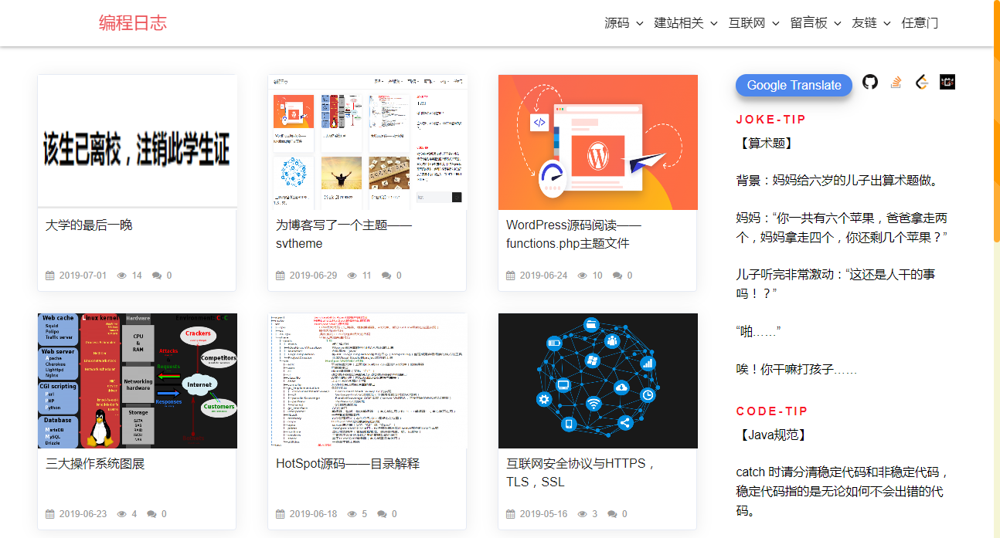
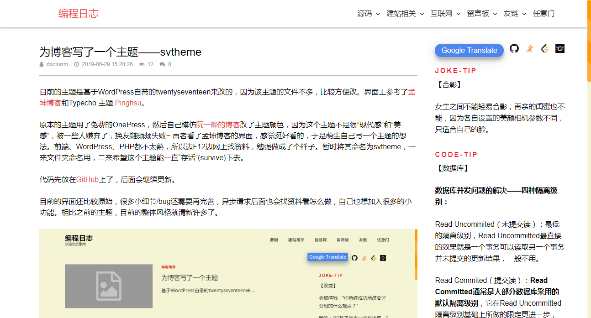
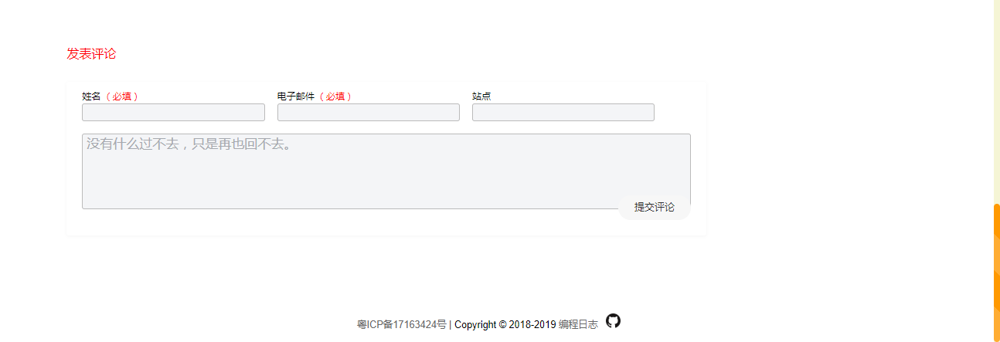

# svtheme——卡片式WordPress主题

## 介绍

目前的主题是基于WordPress自带的twentyseventeen来改的，因为该主题的文件不多，比较方便改。界面上参考了孟坤博客和Typecho 主题 Pinghsu。

功能比较丰富：包括文章卡片式显示、头部响应隐藏，统计浏览量，留言，随机笑话，等等。功能在进一步完善中。

## 安装

直接下载后放到WordPress根目录的/wp-content/themes目录下，在WP后台设置主题为svtheme即可。

*首页*

*文章内容*

*留言样式*

这也是我目前博客的主题，但本主题有两个缺陷：

1、对移动端体验不好；

2、样式代码较为杂乱。

后面可能会对上述问题进行修复。本主题现阶段建议用于学习。